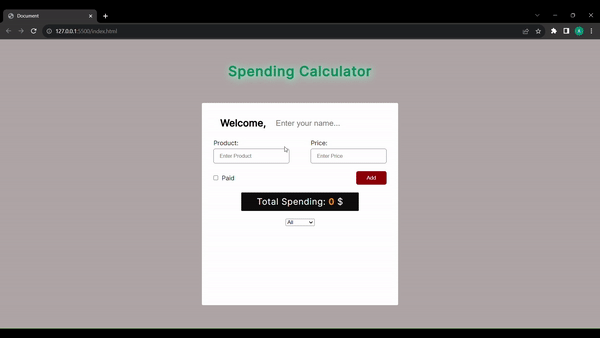

<h1>Money Spending Calculator Project</h1>

This project is a website that allows users to track their expenses and make calculations.

<h2>Project Content</h2>

<ul>
  <li>Message Sending Area</li>
</ul>

<h2>Used Technologies</h2>

<ul>
  <li>HTML</li>
  <li>CSS</li>
  <li>JavaScript</li>
  <li>Google Fonts</li>
</ul>

<h1>Screen Gif</h1>

